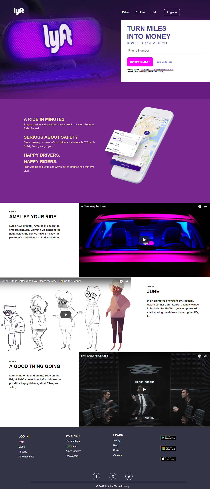

# Lyft con colaboradores

* Armado de carpetas de acuerdo al formato correcto.
* Maquetado web con HTML & CSS.
* semantica en HTML & CSS.

***

Para completar este reto, se reviso lo dado en el repositorio enlace que se nos brindó en el lms_laboratoria.

Se replico la plantilla inicial con los recursos que se nos brindo en el archivo de github. 

## Flujo de trabajo

1. Se realizo un **fork** y  el **clonado** del repositorio.

2. Luego se le hizo **clonar** tu fork en nuestro local.

## Objetivo

* Edicion de las carpetas ASSETS, HTML y CSS con sus respectivas sub carpetas o files.

* Utilizar de manera correcta la semantica de HTML, teniendo en cuenta la estructura de la imagen de la pagina Lyft.

* Aplicar de manera correcta la Identacion en las carpetas HTML y CSS.

* Uso de manera constante de comentarios en las carpetas HTML y CSS, para que de esta manera este mas legible el codigo.

* Uso de manera correcta la clases y pseudoclases de nuestro codigos a realizar.

* Uso de manera correcta las clases reutilizables y lo de uso comun. 

* El codigo de HTML y de CSS(estilos), debe estar entendible, es decir, debe ser legible y facil entendimiento en caso de que alguien aparte de los creadores deseen entender lo editado.

El reto consiste en replicar el sitio de **Lyft**, este será el resultado
a lograr:

